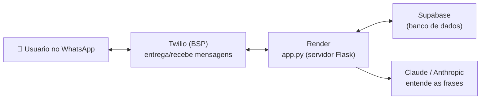
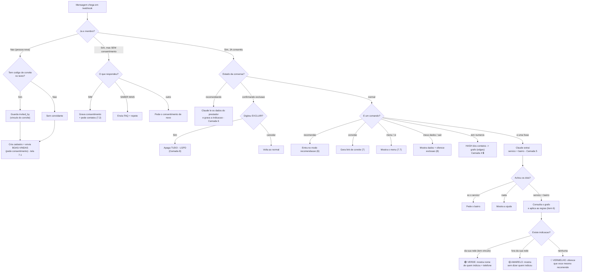
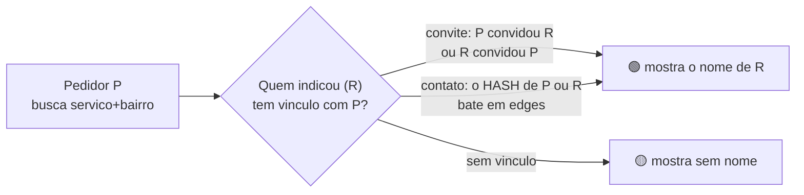

# Fluxograma da Doroteia

> Documento de revisão. Os diagramas abaixo estão em **Mermaid** — abra este
> arquivo no GitHub (ou em um visualizador Markdown) para vê-los como desenho.

---

## 1. Arquitetura (as peças e como conversam)

**Em uma frase:** o usuário fala no WhatsApp → a Twilio entrega pro nosso
servidor no Render → o servidor consulta o banco (Supabase) e, quando precisa
entender uma frase, pergunta pra Claude → e responde de volta pela Twilio.

---

## 2. Fluxo de decisão (o que acontece a cada mensagem)

---

## 3. Mapa: cada etapa ↔ camada do briefing ↔ onde está no código

| Etapa no fluxo | Camada | Arquivo / função |
|---|---|---|
| Recebe a mensagem | 2 | `app.py` → `webhook()` |
| Boas-vindas + consentimento | 3 | `webhook()` (caso novo / sem consent) |
| Contatos → hash → grafo | 4 | `privacidade.py` + `processar_contatos()` |
| Pedir serviço (entender + regras) | 5 | `nlu.py` + `tratar_pedido_servico()` |
| Regras 🟢🟡🔴 (vínculo) | 5/6 | `existe_vinculo()` |
| Recomendar | 6 | `tratar_recomendacao()` |
| Convite (link + vínculo) | 7 | `montar_link_convite()` / `extrair_codigo_convite()` |
| Menu + exclusão (LGPD) | 8 | `texto_meus_dados()` / `excluir_membro()` |

---

## 4. Como o grafo "acende o verde" (resumo da privacidade)

> O vínculo por contato é checado comparando **hashes** (códigos irreversíveis),
> nunca números de telefone. Detalhes em `docs/privacidade-hash.md`.
