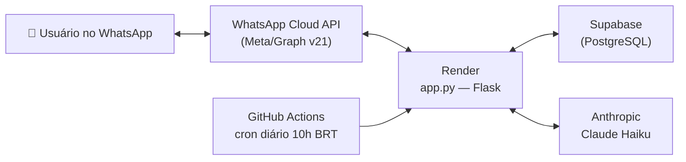
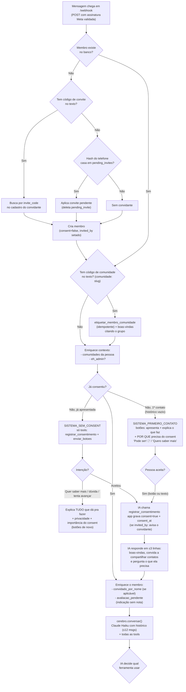
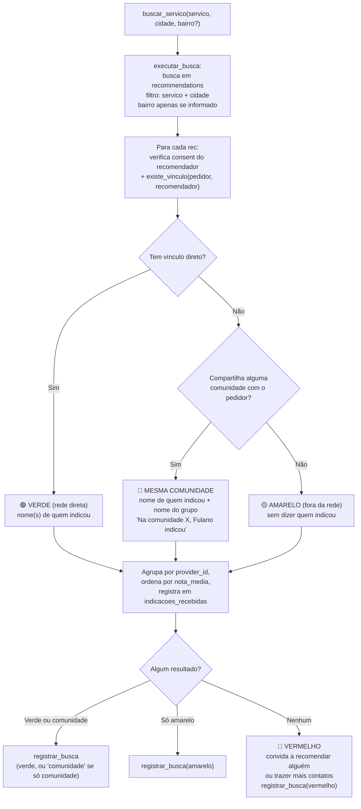
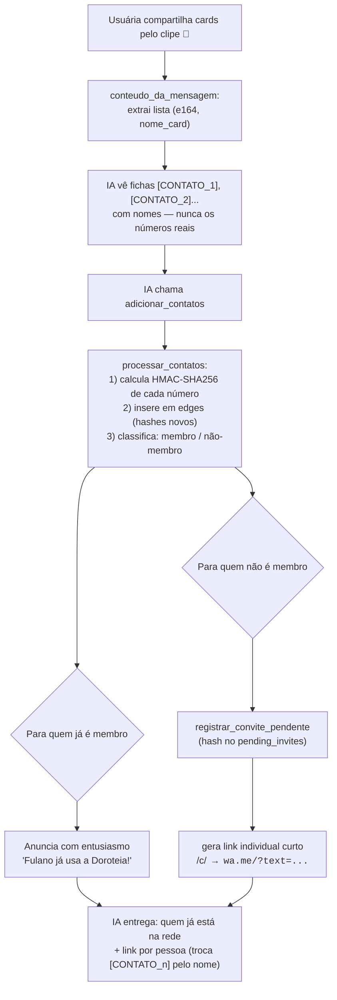
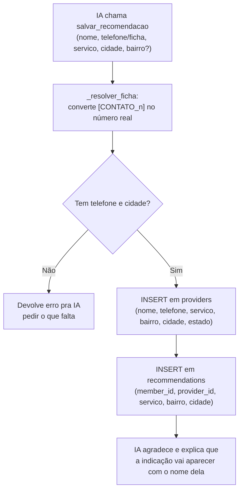
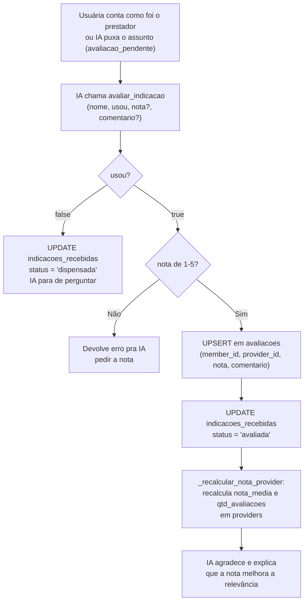
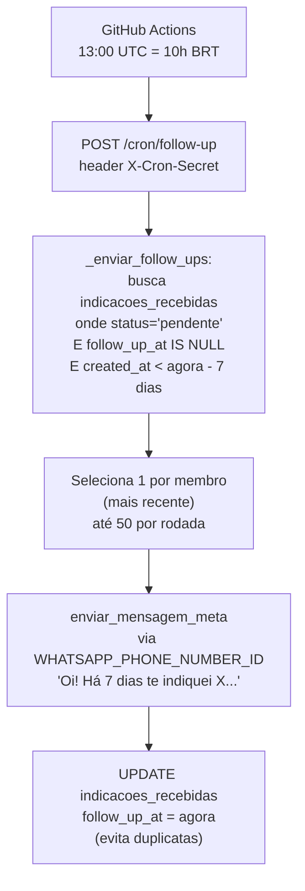
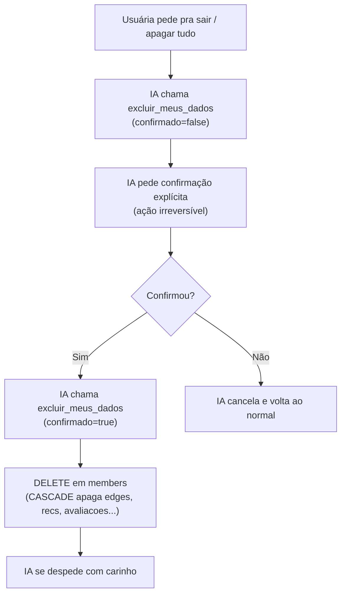
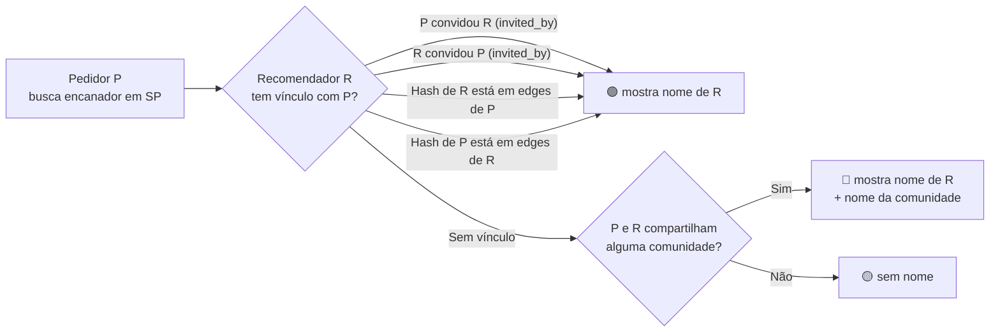

# Fluxograma da Doroteia

> Diagramas em **Mermaid** — abra no GitHub ou num visualizador Markdown pra ver como desenho.

---

## 1. Arquitetura (as peças e como conversam)

**Em uma frase:** o usuário fala no WhatsApp → a Meta entrega pro servidor no Render → o servidor consulta o banco (Supabase) e, quando precisa entender uma frase, pergunta pro Claude Haiku → e responde de volta pela Cloud API. O cron do GitHub Actions dispara um endpoint diário de follow-up.

---

## 2. Fluxo principal — o que acontece a cada mensagem

> **Fase de consentimento sem botão solto:** enquanto a pessoa não consente, o modelo só recebe as ferramentas `registrar_consentimento` e `enviar_botoes` — nenhuma ação real (buscar, indicar, contatos) vaza antes do "ok".

---

## 3. Fluxos por intenção

### 3.1 Buscar uma indicação

Prioridade de apresentação: **🟢 rede direta → 🤝 mesma comunidade → 🟡 fora da rede → 🔴 nada**. Um prestador que apareça em mais de um nível só conta no mais forte.

**Vínculo direto** (`existe_vinculo`): pedidor convidou recomendador, OU recomendador convidou pedidor, OU o hash do telefone de um aparece na tabela `edges` do outro.

**Mesma comunidade:** `comunidades(pedidor) ∩ comunidades(recomendador) ≠ ∅` — derivado em tempo de busca a partir de `comunidade_membros`.

### 3.2 Adicionar contatos + gerar convites (passo único)

### 3.3 Recomendar alguém

### 3.4 Avaliar uma indicação

### 3.5 Follow-up proativo (cron diário)

### 3.6 Painel pessoal

| Ferramenta | O que faz |
|---|---|
| `ver_meus_dados` | Nome, consent, contagens (edges, recommendations) |
| `ver_minhas_indicacoes` | Tudo que ela já indicou, com nota média quando houver |
| `ver_minha_rede` | Quais contatos do grafo dela já são membros com consent |
| `ver_minhas_buscas` | Últimas 10 buscas, com resultado 🟢🤝🟡🔴 |

### 3.7 Exclusão (LGPD)

### 3.8 Comunidades (cada grupo vira um link de entrada)

```mermaid
flowchart TD
    subgraph CRIAR["Organizadora cria a comunidade (admin)"]
      A1["Organizadora (número em ADMIN_WA_IDS)\nmanda 'criar comunidade Plato Perdizes'"] --> A2["IA chama criar_comunidade\n(gated: só admin)"]
      A2 --> A3["slugify → 'plato-perdizes'\nINSERT em comunidades (slug único)"]
      A3 --> A4["Monta link curto:\nwa.me/&lt;bot&gt;?text=...(comunidade: plato-perdizes)"]
      A4 --> A5["IA entrega o link\npra colar no grupo do WhatsApp"]
    end

    subgraph ENTRAR["Pessoa entra pelo link"]
      B1["Clica no link (só circula dentro do grupo)"] --> B2["Mensagem chega com\n'(comunidade: plato-perdizes)'"]
      B2 --> B3["extrair_codigo_comunidade\n→ busca comunidade pelo slug"]
      B3 --> B4["etiquetar_membro_comunidade\n(idempotente, vale p/ novo e p/ quem já usa)"]
      B4 --> B5["Boas-vindas citando o grupo\n'Vi que você chegou pela comunidade X 🙌'"]
    end
```

> **Privacidade:** a Doroteia **nunca lê membros de grupo**. A barreira de entrada é o próprio link — só quem está no grupo o vê. A pessoa se "etiqueta" sozinha ao entrar (dado consentido). 100% legal/LGPD.

---

## 4. Regras de vínculo (como o verde acende)

> O vínculo por contato é checado comparando **HMAC-SHA256** dos números (irreversíveis), nunca os números em si. Detalhes em `docs/privacidade-hash.md`.

---

## 5. Mapa: arquivo → função → tabela

| Função | Arquivo | Tabela(s) |
|---|---|---|
| Receber mensagem | `app.py / webhook()` | — |
| Criar membro | `app.py / criar_membro()` | `members` |
| Gravar consentimento | `app.py / registrar_consentimento()` | `members` |
| Hash + grafo de contatos | `app.py / processar_contatos()` | `edges` |
| Busca verde/comunidade/amarelo/vermelho | `app.py / executar_busca()` | `recommendations`, `members`, `edges`, `comunidade_membros` |
| Criar comunidade (admin) | `app.py / criar_comunidade()` + `_ferr_criar_comunidade()` | `comunidades` |
| Etiquetar membro na entrada | `app.py / etiquetar_membro_comunidade()` | `comunidade_membros` |
| Salvar recomendação | `app.py / _ferr_recomendar()` | `providers`, `recommendations` |
| Convite por telefone | `app.py / registrar_convite_pendente()` | `pending_invites` |
| Aplicar convite ao entrar | `app.py / aplicar_convite_pendente()` | `pending_invites`, `members` |
| Link curto `/c/<code>` | `app.py / encurtar_link()` + `redirecionar_link()` | `short_links` |
| Indicação recebida (follow-up) | `app.py / registrar_indicacao_recebida()` | `indicacoes_recebidas` |
| Avaliar indicação | `app.py / _ferr_avaliar()` | `avaliacoes`, `indicacoes_recebidas`, `providers` |
| Follow-up proativo | `app.py / _enviar_follow_ups()` | `indicacoes_recebidas` |
| Painel buscas | `app.py / _ferr_ver_buscas()` | `searches` |
| Painel rede | `app.py / _ferr_ver_rede()` | `edges`, `members` |
| Painel indicações | `app.py / _ferr_ver_indicacoes()` | `recommendations`, `providers` |
| IA conversacional | `cerebro.py / conversar()` | `members` (historico) |

---

## 6. Banco de dados (tabelas atuais)

| Tabela | Para que serve |
|---|---|
| `members` | Cadastro, consent, histórico de conversa (jsonb) |
| `edges` | Grafo de confiança — só hashes dos contatos |
| `providers` | Prestadores/médicos/escolas indicados |
| `recommendations` | Quem indicou qual provider |
| `searches` | Métricas de busca (servico, bairro, cidade, resultado, member_id) |
| `pending_invites` | Convites a quem ainda não entrou (hash do telefone) |
| `short_links` | Encurtador interno `/c/<code>` |
| `avaliacoes` | Notas 1–5 por membro por provider |
| `indicacoes_recebidas` | Providers mostrados a cada pessoa → base do follow-up |
| `comunidades` | Grupos reais (escola, prédio, bairro) com slug + nome |
| `comunidade_membros` | Quem pertence a qual comunidade (N-para-N) |

---

## 7. Variáveis de ambiente necessárias (Render)

| Variável | Para que serve |
|---|---|
| `SUPABASE_URL` | Conexão com o banco |
| `SUPABASE_KEY` | Chave de serviço do Supabase |
| `WHATSAPP_TOKEN` | Token da WhatsApp Cloud API (Meta) |
| `WHATSAPP_VERIFY_TOKEN` | Token de verificação do webhook Meta |
| `WHATSAPP_APP_SECRET` | Valida assinatura das mensagens recebidas |
| `WHATSAPP_PHONE_NUMBER_ID` | ID do número do bot (usado no cron de follow-up) |
| `ANTHROPIC_API_KEY` | Chave da API do Claude Haiku |
| `CONTACT_HASH_KEY` | Chave secreta do HMAC-SHA256 dos contatos |
| `PUBLIC_BASE_URL` | Base para links curtos (ex: `https://doroteia-ia.onrender.com`) |
| `CRON_SECRET` | Protege o endpoint `/cron/follow-up` |
| `ADMIN_WA_IDS` | Números de organizadora (só dígitos, separados por vírgula) que podem criar comunidades |

| Variável | Onde também configurar |
|---|---|
| `CRON_SECRET` | GitHub Secrets (usado pelo workflow `follow-up.yml`) |
